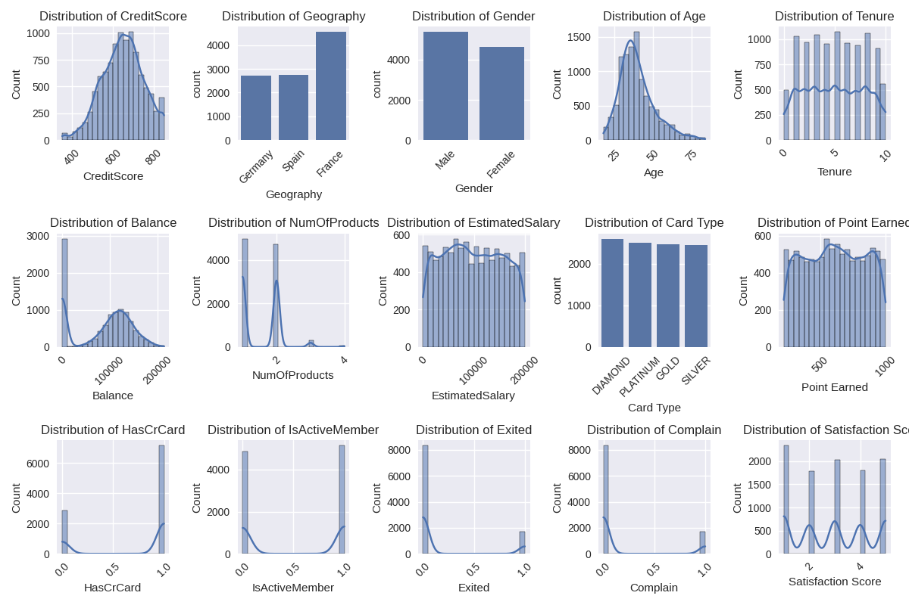
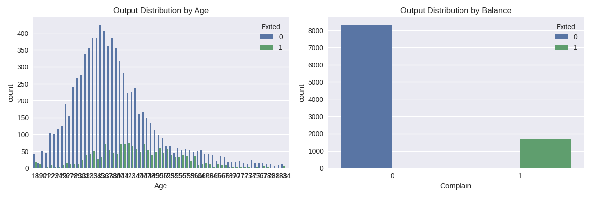
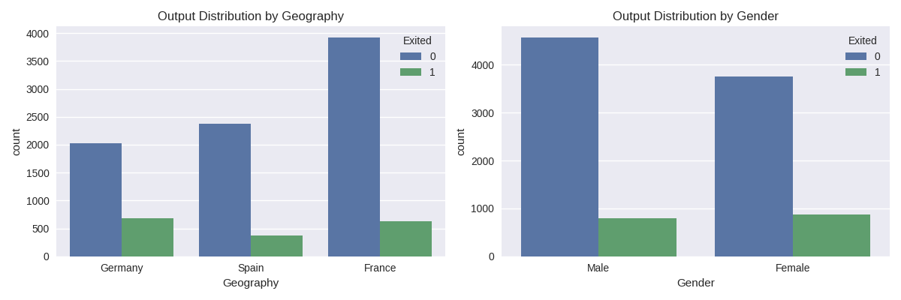

# `bank-churn`

This repository a synthetic dataset representing customers who have left a bank. The dataset includes various features related to the customers, such as their credit score, geography, age, tenure, balance, and more.

## Dataset Features

The following table describes the features present in the dataset:

| Feature           | Description                                        |
|-------------------|----------------------------------------------------|
| CreditScore       | Customer's credit score                            |
| Geography         | Customer's geographic location                     |
| Gender            | Customer's gender                                  |
| Age               | Customer's age                                     |
| Tenure            | Number of years the customer has been with the bank |
| Balance           | Customer's account balance                         |
| NumOfProducts     | Number of products the customer has with the bank   |
| EstimatedSalary   | Customer's estimated salary                        |
| Card Type         | Type of credit card the customer holds             |
| Point Earned      | Number of points earned by the customer             |
| HasCrCard         | Whether the customer has a credit card (0 or 1)     |
| IsActiveMember    | Whether the customer is an active member (0 or 1)   |
| Exited            | Whether the customer has churned (0 or 1)           |
| Complain          | Whether the customer has filed a complaint (0 or 1) |
| Satisfaction Score| Customer's satisfaction score (1-5)                |

## Exploratory Data Analysis

### Distribution of Features

This plot shows the distribution of each feature in the dataset. This helps to understand the range, frequency, and distribution of values for each feature.

### Output Distribution by Important Features

 This plot shows how the output variable (`Exited`) is distributed according to the two most important features (`Age` and `Complain`).

### Output Distribution by Less Important Features

This plot shows the output distribution based on two less important features (`Geography` and `Gender`).

