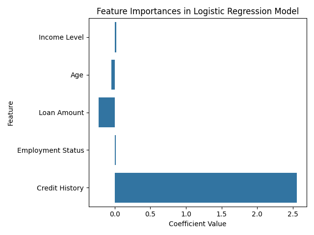

# `credit-score` model

The purpose of this model is to provide an example for saliency-based explanation methods.

The model is a logistic regression model using the `make_classification` method to defined well-separated features.

The model contains 5 features, two of which are informative.

