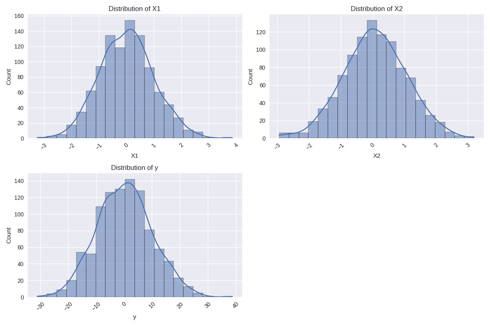
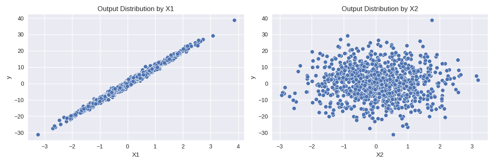

# `explainer-test-a`

This repository contains a simple linear regression model trained on a synthetic dataset generated within the `train.py` file. 
The dataset includes two features with varying degrees of impact on the output variable.

## Dataset Description

The synthetic dataset is generated with the following characteristics:

- **Number of samples**: 1000
- **Features**:
  - **X1**: High impact on the output variable
  - **X2**: Low impact on the output variable
- **Output (y)**: A linear combination of the features with added noise

The data generation process ensures that `X1` has a significant influence on `y`, while `X2` has a minor impact.

## Features

| Feature | Description                           |
|---------|---------------------------------------|
| X1      | Feature with high impact on the output|
| X2      | Feature with low impact on the output |
| y       | Output variable                       |

## Exploratory Data Analysis

### Distribution of Features

This plot shows the distribution of each feature in the dataset.

### Output Distribution by Features

These plots show how the output variable (`y`) is distributed according to the most and least important features (`X1` and `X2`).

