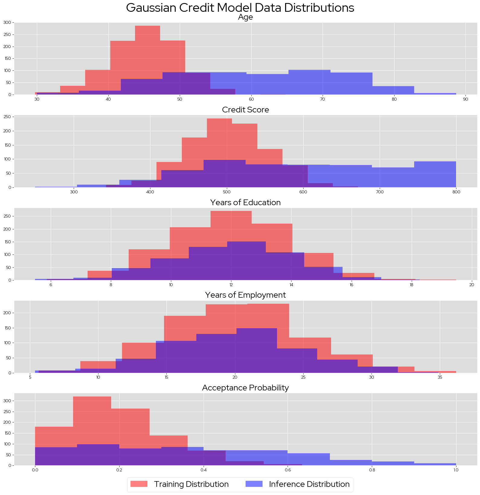

# Gaussian Credit Model
The Gaussian Credit Model is a simple XGBoost regression model trained on synthetic "credit acceptance" data. 
Each feature is assigned a weight according to a simple function, limited between 0 and 1:
* `Age Weight = (Age - 10)/15`
* `Credit Score Weight = (Credit Score - 400)/300`
* `Years of Education Weight = (Years of Education)^2 / 250`
* `Years of Employment Weight = sqrt(Years of Employment) / 3`

The underlying "credit acceptance probability" function is:
`Probability` = `Age Weight` * `Credit Score Weight` * `Years of Education Weight` * `Years of Employment Weight`

Since all features and the output are continuous, additional synthetic data can be generated easily. Two generated datasets 
are saved in the `data` repo, one containing a single payload of "training" data, and one containing batches o "inference data" that slowly drift away from the original training distribution. The cumulative feature distributions of the two datasets can be seen here:




## Deploying the Gaussian Credit models on ODH/RHOAI
1) Deploy the [Model Storage Container](https://github.com/trustyai-explainability/odh-trustyai-demos/blob/main/2-BiasMonitoring/modelmesh-demo/resources/model_storage_container.yaml)
2) Deploy the default OVMS Serving Runtime, installable from ODH dashboard, and make a note of the name you assign the runtime.
3) Deploy the following ISVC:

**Note: make sure that `$RUNTIME_NAME` matches whatever name you chose in step 2.**
```yaml
apiVersion: serving.kserve.io/v1beta1
kind: InferenceService
metadata:
  name: loan-model-$ALPHA_OR_BETA
  annotations:
    serving.kserve.io/deploymentMode: ModelMesh
  labels:
    opendatahub.io/dashboard: "true"
spec:
  predictor:
    model:
      modelFormat:
        name: openvino
      runtime: $RUNTIME_NAME
      storage:
        key: aws-connection-minio-data-connection
        path: sklearn/gaussian-credit