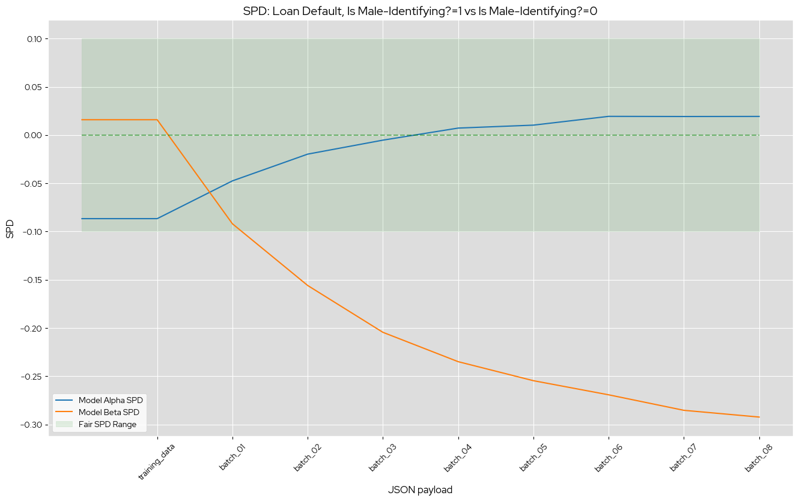

# Loan Model Alpha and Loan Model Beta
These are two small Keras neural networks, with one model trained with deliberately poor data practices such as to induce significant bias. These models predict credit defaulting given some demographic attributes
of a credit applicant:
* Number of Children
* Total Income
* Number of Total Family Members
* Is Male-Identifying?
* Owns Car?
* Owns Realty?
* Is Partnered?
* Is Employed?
* Live with Parents?
* Age (in days)
* Length of Employment (in days)

The alpha model is trained on a relatively balanced set of data. Meanwhile, all non-defaulting, non-male applicants over the age of ~41 are removed from the beta model, which drastically biases it against those candidates. The sample "training data" is then specifically sampled to hide the beta model's biases, while the "deployment" data overwhelmingly contains non-male applicants over the age of ~41. This causes the beta model to appear non-biased at deployment
time, but rapidly grow more biased as more "real-world deployment" data arrives. 

This progression of bias in the two models can be seen here, with the x-axis corresponding to the payloads within `data/batches`:


## Deploying the loan models models on ODH/RHOAI
1) Deploy the [Model Storage Container](https://github.com/trustyai-explainability/odh-trustyai-demos/blob/main/2-BiasMonitoring/modelmesh-demo/resources/model_storage_container.yaml)
2) Deploy the default OVMS Serving Runtime, installable from ODH dashboard, and make a note of the name you assign the runtime.
3) Configure and deploy the following ISVC:
   1) Replace `$ALPHA_OR_BETA` with `alpha` or `beta` depending on which model you want to deploy 
   2) Make sure that `$RUNTIME_NAME` matches whatever name you chose in step 2.
```yaml
apiVersion: serving.kserve.io/v1beta1
kind: InferenceService
metadata:
  name: loan-model-$ALPHA_OR_BETA
  annotations:
    serving.kserve.io/deploymentMode: ModelMesh
  labels:
    opendatahub.io/dashboard: "true"
spec:
  predictor:
    model:
      modelFormat:
        name: openvino
      runtime: $RUNTIME_NAME
      storage:
        key: aws-connection-minio-data-connection
        path: openvino/loan-model-$ALPHA_OR_BETA
```